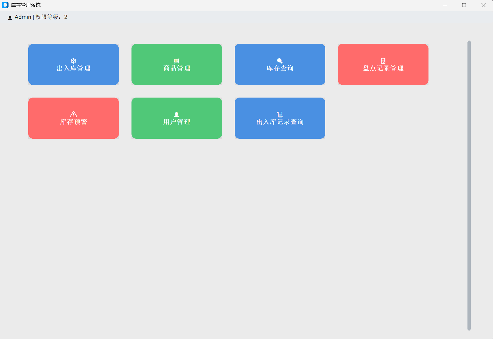

# 📦 库存管理系统 Inventory Management System



> 一个适用于中小企业的图形化库存管理系统，基于 Python 与 SQL Server 开发，支持出入库管理、库存预警、报表导出等功能。

A GUI-based inventory system for small to medium-sized enterprises, built with Python and SQL Server. Features include inbound/outbound management, alerts, and Excel report export.

---

## 🚀 快速开始 Quick Start

```bash
# 克隆项目 Clone the repo
git clone https://github.com/你的用户名/Inventory-Management-System.git
cd Inventory-Management-System

# 安装依赖 Install dependencies
pip install -r requirements.txt

# 运行 Run the app
python main.py
```

---

## 🔧 技术栈 Tech Stack

| 技术 | 描述 |
|------|------|
| Python | 主体开发语言 Main development language |
| pyodbc | 数据库连接方式 Database connection |
| SQL Server | 后端数据库 Backend database |
| customtkinter | GUI 框架 Graphical interface library |
| openpyxl | Excel 报表导出 Exporting Excel reports |
| CTkTable / ttk.Treeview | 表格展示 Table view |

---

## ✨ 功能 Features

- 🔐 用户登录 / User Authentication
- ➕ 商品新增 / Add Products
- ✏️ 商品编辑 / Edit Products
- ❌ 商品删除 / Delete Products
- 🔍 商品搜索 / Search
- 🚚 出入库记录 / Inbound & Outbound Tracking
- 🚨 库存预警 / Stock Alerts
- 📊 月结报表 / Monthly Summary (Excel 导出)
- 💾 自动备份 / Auto Backup Support

---

## 📁 项目结构 Project Structure

```
├── main.py                  # 主程序入口 Main app
├── login.py                 # 登录模块 Login module
├── product_management.py    # 商品管理模块 Product management
├── report_module.py         # 月结报表模块 Monthly report
├── database_config.py       # 数据库连接配置 DB connection config
├── assets/                  # 截图与资源 Screenshots & assets
├── backup_job_config.md     # SQL Server 自动备份设置说明
├── README.md                # 项目说明 Project readme
```

---

## 🙋‍♀️ 作者 Author

- 🎓 专业 Major：数据科学与大数据技术 / Data Science & Big Data Technology  
- 🎯 方向 Focus：人工智能、数据分析、金融科技 / AI & Data & FinTech  
- 🌐 GitHub: [clouds1102](https://github.com/clouds1102)

---

## 📌 声明 Disclaimer

本项目用于学习展示，欢迎交流与建议。This project is for learning and demo purposes. Contributions and suggestions are welcome!
